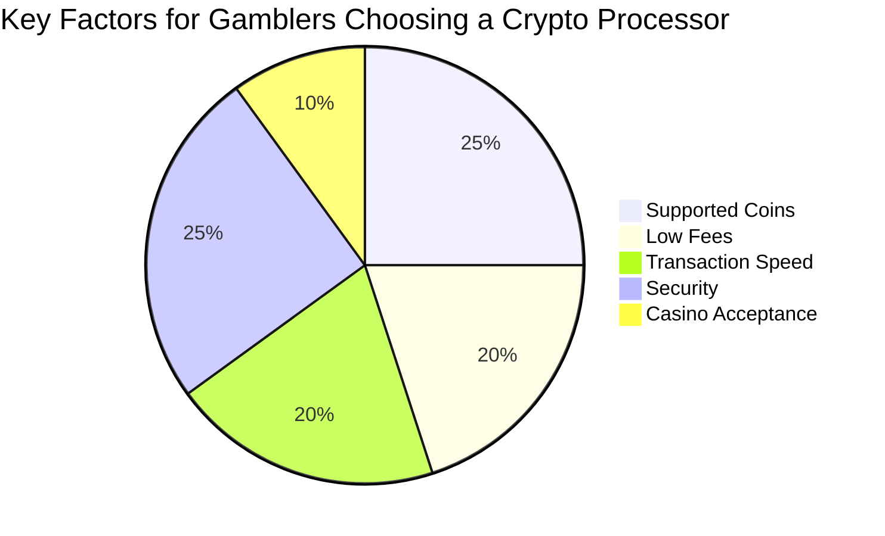

# Crypto Payment Processors: Your Ultimate Guide to Gambling with Digital Coins 🎰

The world of online gambling is buzzing, and a big reason why is cryptocurrency! 🚀 If you're a gambler looking to dive into using Bitcoin, Ethereum, or other digital coins for your casino fun, you've come to the right place. Understanding **crypto payment processors** is key to a smooth and secure experience. This guide will break down everything you need to know about these **gambling payment gateways**, compare some top options, and help you navigate the exciting world of **crypto casino payments**.

## 👋 Welcome to the Future of Casino Banking: Crypto!

Gone are the days when your only options for funding online casino accounts were credit cards or bank transfers. Cryptocurrencies have burst onto the scene, offering a new level of speed, privacy, and control. But how do these digital coins actually move from your wallet to the casino's and back again? That's where **crypto payment processors** come in.

Think of them as the digital bridge connecting your crypto funds to your favorite online gambling sites. They make **crypto casino payments** possible, and understanding how they work is crucial for any modern gambler.

> **Pull Quote:** "Using crypto for online gambling isn't just a trend; it's a smarter way to play for many. The right **crypto transaction processor** makes all the difference."

This in-depth guide will explore:

* What **blockchain payment systems** are and why they matter for gamblers.
* Key features to look for when choosing a processor.
* A comparison of popular **crypto payment processors** in the gambling space.
* How to make deposits and withdrawals using crypto.
* The risks and rewards involved.

Let's get started!

## 🧐 Understanding Crypto Payment Processors for Gambling

So, what exactly are these **crypto payment processors**, and why should you, as a gambler, care about them?

### What are Crypto Payment Processors?

A **crypto payment processor** is a service that helps businesses, including online casinos, accept and process payments made in cryptocurrencies. Essentially, they act as intermediaries, much like traditional payment gateways (think PayPal or Stripe) do for fiat currencies (like USD or EUR). However, these specialized processors deal with digital assets like Bitcoin (BTC), Ethereum (ETH), Litecoin (LTC), and many others.

For gamblers, this means:

* **Easier Deposits:** You can send crypto from your personal wallet, and the processor ensures the casino receives it correctly and credits your account.
* **Smoother Withdrawals:** When you cash out your winnings, the processor facilitates the transfer of crypto back to your wallet.

These **blockchain payment systems** handle the technical side of transactions, converting currencies if needed, and providing a layer of security and convenience. They are a vital cog in the machinery of modern **crypto casino payments**.

### Why Gamblers are Turning to Crypto Payments 🤩

There's a good reason why so many players are choosing crypto for their online gambling adventures. The benefits are hard to ignore:

* **Enhanced Privacy & Anonymity 🤫:** While not entirely anonymous (blockchain transactions are traceable), crypto payments generally offer more privacy than traditional banking methods. You often don't need to share as much sensitive personal information with the casino or third-party payment providers.
* **Faster Transactions ⚡:** Say goodbye to waiting days for your winnings! Crypto transactions, especially with certain coins, can be incredibly fast. Deposits are often near-instant, and withdrawals can be processed much quicker than bank transfers. This is a huge plus for **crypto casino payments**.
* **Lower Fees 💰:** Traditional payment methods can come with hefty fees, especially for international transactions. **Crypto transaction processors** often have lower fees, meaning more of your money stays in your pocket – or goes towards your next bet!
* **Accessibility & Global Reach 🌍:** Cryptocurrencies are borderless. As long as you have an internet connection, you can send and receive crypto from almost anywhere in the world. This opens up more casino options for players in regions with restrictive banking.
* **Security (Thanks, Blockchain!) 🔒:** **Blockchain payment systems** are built on decentralized ledger technology, which is inherently secure. Transactions are encrypted and verified by a network of computers, making them very difficult to tamper with.
* **No Chargebacks (Usually):** For casinos, a big plus is that crypto transactions are generally irreversible. For players, this means you need to be extra careful, but it also contributes to the stability some casinos seek.

## 🔑 Key Features to Look for in a Crypto Payment Processor for Gambling

Not all **crypto payment processors** are created equal, especially when it comes to the specific needs of online gamblers. Here's what you should keep an eye out for:

1. **Supported Cryptocurrencies:**
   * Does the processor support a wide range of popular coins like Bitcoin (BTC), Ethereum (ETH), Litecoin (LTC), Tether (USDT), Ripple (XRP), Dogecoin (DOGE), etc.?
   * More importantly, does it support the specific cryptocurrencies *you* want to use and that your chosen *online casino* accepts?
2. **Transaction Speed:**
   * How quickly are deposits confirmed and credited to your casino account?
   * How fast are withdrawal requests processed by the **gambling payment gateway**? Some processors prioritize speed.
3. **Fees:**
   * **Transaction Fees:** What percentage or flat fee is charged per transaction?
   * **Conversion Fees:** If the casino operates in a different currency (even a different crypto) than what you're depositing, are there conversion fees?
   * **Withdrawal Fees:** Are there fees for cashing out your crypto?
   * Transparency in fees is crucial. Look for a clear fee schedule.
4. **Security Measures:**
   * This is paramount for **crypto casino payments**. Look for:
     * **Two-Factor Authentication (2FA):** An essential layer of security for your account.
     * **Cold Storage:** Does the processor keep a significant portion of funds offline, away from hackers?
     * **Encryption:** Are your data and transactions encrypted?
     * **Insurance:** Some processors offer insurance for funds held.
5. **Ease of Use:**
   * Is the interface intuitive and user-friendly, even if you're new to crypto?
   * Is it easy to track your transactions?
   * Does it work well on both desktop and mobile devices?
6. **Customer Support:**
   * If something goes wrong, you need reliable support.
   * Is customer service available 24/7?
   * What channels are offered (live chat, email, phone)? How responsive are they?
7. **Reputation and Reliability:**
   * How long has the **crypto payment processor** been in business?
   * What do user reviews say? Look for feedback specifically from other gamblers if possible.
   * Are they licensed or regulated in any jurisdiction (this can be a good sign, though not always required for crypto processors)?
8. **Integration with Casinos:**
   * How widely is the processor accepted by reputable online casinos? A processor isn't useful if your preferred casinos don't support it.
9. **Geographical Restrictions:**
   * Are there any countries from which you cannot use the service? This is especially important for online gambling, which has varying legal statuses worldwide.
10. **Anonymity/Privacy Features:**
    * While blockchain itself offers some privacy, some **crypto transaction processors** might require more KYC (Know Your Customer) than others. Understand their policies.

Finding a processor that ticks all these boxes can significantly enhance your crypto gambling experience.

## 🏆 Top Crypto Payment Processors for Gamblers: A Comparison

Now for the exciting part! Let's look at some of the leading **crypto payment processors** frequently used in the online gambling industry. Remember, the "best" one often depends on your individual needs and the casinos you play at.

*Disclaimer: The information below is for general guidance. Always do your own research (DYOR) before choosing a processor and ensure it aligns with the terms of your chosen online casino.*

Here are a few notable names in the **gambling payment gateways** space:

### 1. CoinsPaid

* **Overview:** CoinsPaid is a major player specifically focused on the iGaming and e-commerce industries. They are well-regarded for their robust infrastructure and wide acceptance among crypto casinos. They act as a **crypto transaction processor** that many online casinos integrate directly.
* **Pros:**
  * Widely supported by online casinos.
  * Supports over 50 cryptocurrencies (including BTC, ETH, LTC, USDT, DOGE, XRP) and several fiat currencies.
  * Fast transactions and relatively low fees.
  * Strong security features, including an anti-fraud system.
  * User-friendly interface for casino operators, which indirectly benefits players through smoother operations.
* **Cons:**
  * Primarily a B2B solution, so as a player, you interact with it *through* the casino rather than signing up with CoinsPaid directly for gambling transactions.
  * Fees can vary depending on the casino's arrangement.
* **Supported Cryptos:** Extensive (BTC, ETH, USDT, LTC, BCH, DOGE, XRP, ADA, TRX, and many more).
* **Typical Fees:** Usually a small percentage per transaction, often absorbed by the casino or very competitive.
* **Security:** Advanced fraud prevention, regular security audits, optional cold storage for clients.
* **Ideal for:** Gamblers who play at casinos that have integrated CoinsPaid, offering a seamless experience.

### 2. BitPay

* **Overview:** BitPay is one of the oldest and most well-known **crypto payment processors**. While they serve a broad range of industries, they are also used by some online gambling platforms.
* **Pros:**
  * Established reputation and brand recognition.
  * Supports major cryptocurrencies like Bitcoin (BTC), Bitcoin Cash (BCH), Ethereum (ETH), Wrapped Bitcoin (WBTC), Dogecoin (DOGE), Litecoin (LTC), Shiba Inu Coin (SHIB), and 5 USD-pegged stablecoins (GUSD, USDC, USDP, DAI, and BUSD).
  * Offers a BitPay Card (in some regions) to spend crypto like cash.
  * Relatively easy to use.
* **Cons:**
  * May have stricter KYC/AML (Know Your Customer/Anti-Money Laundering) policies.
  * Transaction fees can sometimes be higher than newer, more specialized competitors.
  * Not all online casinos that accept crypto will use BitPay as their primary processor.
* **Supported Cryptos:** BTC, BCH, ETH, WBTC, DOGE, LTC, SHIB, GUSD, USDC, USDP, DAI, BUSD.
* **Typical Fees:** Network cost + 1% transaction fee.
* **Security:** Multi-signature security, 2FA, industry-standard security protocols.
* **Ideal for:** Players who already use BitPay for other services or prefer a long-standing name, provided their casino supports it.

### 3. CoinPayments

* **Overview:** CoinPayments is another popular **crypto payment processor** that supports a vast number of cryptocurrencies. They cater to various online businesses, including some in the gambling sector.
* **Pros:**
  * Supports over 2,000+ cryptocurrencies – one of the widest selections available.
  * Relatively low transaction fees (typically around 0.5%).
  * Offers a multi-coin wallet and various merchant tools.
  * Accepted by a decent number of online merchants and some casinos.
* **Cons:**
  * Customer support has received mixed reviews at times.
  * The sheer number of supported coins can be overwhelming, and not all are suitable for gambling.
  * Interface might feel less polished than some competitors.
* **Supported Cryptos:** Extensive list including BTC, ETH, LTC, and many altcoins.
* **Typical Fees:** Generally 0.5% per transaction.
* **Security:** BitGo integration (multi-sig, cold storage), 2FA.
* **Ideal for:** Gamblers who want to use a wide variety of altcoins or play at casinos specifically integrated with CoinPayments.

### 4. NOWPayments

* **Overview:** NOWPayments is a non-custodial **crypto payment gateway**, meaning they don't hold your funds. They facilitate direct wallet-to-wallet payments and are gaining traction in various sectors, including online gambling.
* **Pros:**
  * Non-custodial, which can be seen as a security advantage (you control your keys).
  * Supports a wide range of 150+ cryptocurrencies.
  * Transparent and competitive fees, starting from 0.4%.
  * Offers features like auto coin conversion.
  * Focus on ease of integration for merchants.
* **Cons:**
  * Being non-custodial means responsibility for wallet security is entirely on the user and the casino.
  * Relatively newer compared to BitPay or CoinsPaid, so brand recognition might be lower.
* **Supported Cryptos:** BTC, ETH, USDT, XRP, LTC, and 100+ others.
* **Typical Fees:** Starts at 0.5% per transaction, with a 0.1% service fee. Volume discounts available.
* **Security:** Non-custodial nature, secure API, regular updates.
* **Ideal for:** Players and casinos who prioritize non-custodial solutions and want flexibility in coin choice.

***

### Comparison Table: Crypto Payment Processors for Gambling

| Feature                | CoinsPaid                         | BitPay                                      | CoinPayments                       | NOWPayments                           |
| :--------------------- | :-------------------------------- | :------------------------------------------ | :--------------------------------- | :------------------------------------ |
| **Primary Focus**      | iGaming, E-commerce               | General Crypto Payments                     | General Crypto Payments, Merchants | Non-Custodial Payments                |
| **Supported Coins**    | 50+ (BTC, ETH, USDT, etc.)        | BTC, BCH, ETH, Stablecoins, DOGE, LTC, SHIB | 2000+ (BTC, ETH, LTC, Altcoins)    | 150+ (BTC, ETH, USDT, etc.)           |
| **Typical Fees**       | Varies by casino (competitive)    | Network cost + 1%                           | \~0.5%                             | Starts at 0.4% + 0.1%                 |
| **Custodial?**         | Yes (for merchants)               | Yes (offers wallet/custody)                 | Yes (offers wallet/custody)        | No (Non-Custodial)                    |
| **Gambling Focus**     | Very High                         | Moderate                                    | Moderate                           | Growing                               |
| **Security**           | Advanced Anti-Fraud, Audits       | Multi-Sig, 2FA                              | BitGo Insured, 2FA                 | Secure API, Non-Custodial             |
| **Ease of Use**        | Seamless (integrated into casino) | Good                                        | Okay                               | Good                                  |
| **Player Interaction** | Indirectly via casino             | Can use BitPay wallet/app                   | Can use CoinPayments wallet        | Direct wallet-to-wallet via processor |

***

📊 **Chart: Key Considerations When Choosing a Processor**

This chart highlights that for most gamblers, supported coins, low fees, transaction speed, and robust security are top priorities when evaluating **crypto payment processors** or the **gambling payment gateways** their chosen casinos use.

## 📖 How to Use a Crypto Payment Processor for Online Gambling: A Step-by-Step Guide

Ready to make your first **crypto casino payment**? Here’s a general guide. The exact steps might vary slightly depending on the casino and the specific **crypto transaction processor** they use, but the core process is similar.

**Step 1: Get a Crypto Wallet & Buy Crypto**

* If you don't have one already, you'll need a personal crypto wallet (e.g., Exodus, Trust Wallet, a hardware wallet like Ledger, or an exchange wallet like Binance or Coinbase).
* Purchase the cryptocurrency you intend to use from an exchange. Make sure it's a coin accepted by both the casino and its **blockchain payment system**.

**Step 2: Choose a Crypto-Friendly Online Casino**

* Select an online casino that accepts cryptocurrency deposits and withdrawals. Check which **crypto payment processors** they partner with, or if they handle transactions directly.

**Step 3: Making a Deposit**

1. **Navigate to the Casino's Cashier/Deposit Section:** Log in to your casino account and find the deposit page.
2. **Select Cryptocurrency as Payment Method:** Choose the specific crypto you want to deposit (e.g., Bitcoin).
3. **Enter Deposit Amount:** Specify how much you want to deposit. The casino might show you the equivalent in crypto.
4. **Get the Casino's Wallet Address:** The casino, often via its integrated **crypto payment processor**, will provide a unique wallet address (a long string of characters) or a QR code. This is where you'll send your crypto.
   * ⚠️ **Critical Tip:** Always copy and paste the address. Double-check the first few and last few characters to ensure it's correct. Sending crypto to the wrong address usually means it's lost forever!
5. **Send Crypto from Your Wallet:**
   * Go to your personal crypto wallet.
   * Select the "Send" or "Withdraw" option.
   * Paste the casino's wallet address into the recipient field.
   * Enter the amount of crypto to send (make sure it matches what you told the casino, or slightly more to cover network fees if applicable).
   * Confirm the transaction. You might need to pay a small network fee (gas fee for Ethereum, miner fee for Bitcoin).
6. **Wait for Confirmation:** Crypto transactions need to be confirmed on the blockchain. This can take anywhere from a few minutes to an hour, depending on the crypto and network congestion. The **crypto payment processor** and casino will monitor this.
7. **Funds Credited:** Once confirmed, the funds should appear in your casino account.

**Step 4: Withdrawing Your Winnings**

1. **Go to the Casino's Withdrawal Section:** Similar to depositing, find the withdrawal page.
2. **Select Cryptocurrency:** Choose the crypto you want to withdraw.
3. **Enter Withdrawal Amount:** Specify how much you want to cash out.
4. **Provide Your Wallet Address:** This time, you'll provide *your* personal crypto wallet address. Again, copy and paste it carefully.
5. **Confirm Withdrawal:** The casino will process your request. This might involve an internal review period.
6. **Receive Crypto:** Once approved and sent by the casino (often facilitated by their **gambling payment gateway**), the crypto will arrive in your personal wallet after blockchain confirmation.

**Tips for Smooth Transactions:**

* **Small Test Transaction:** For your first time, consider making a small test deposit and withdrawal to get comfortable with the process.
* **Check Fees:** Be aware of any network fees from your wallet and any potential fees from the casino or its processor.
* **Understand Confirmation Times:** Different cryptos have different confirmation times. Be patient.
* **Secure Your Wallet:** Use strong passwords, enable 2FA on your wallet and exchange accounts, and be wary of phishing scams.

> **Pull Quote:** "Mastering **crypto casino payments** is easier than you think. Accuracy and patience are your best friends during transactions."

## ⚠️ The Risks and Challenges of Using Crypto for Gambling

While **crypto payment processors** and digital currencies offer many advantages for gamblers, it's important to be aware of the potential downsides:

* **Volatility of Cryptocurrencies 📉📈:** The value of cryptocurrencies can swing wildly. The Bitcoin you deposited might be worth more or less by the time you withdraw. This can work for or against you. Stablecoins (like USDT) can mitigate this risk.
* **Regulatory Uncertainty:** The legal landscape for cryptocurrencies and online gambling is still evolving in many countries. This can affect the availability and operation of **gambling payment gateways** and casinos.
* **Security Risks (Beyond the Processor):**
  * **Phishing Scams:** Fake websites or emails trying to steal your crypto wallet keys or login details.
  * **Malware:** Viruses designed to access your crypto.
  * **User Error:** Sending funds to the wrong address is irreversible. You are responsible for securing your own wallet.
* **Transaction Irreversibility:** If you make a mistake or get scammed, it's very difficult (often impossible) to get your crypto back. Always double-check everything.
* **Learning Curve:** For those new to crypto, there's a learning curve involved in setting up wallets, buying coins, and understanding how **blockchain payment systems** work.
* **Not All Casinos Are Equal:** Just because a casino accepts crypto doesn't mean it's reputable. Always play at licensed and well-reviewed online casinos.

Being informed about these risks allows you to take precautions and gamble more responsibly.

## 🚀 The Future of Crypto Payments in Online Gambling

The intersection of cryptocurrency and online gambling is a rapidly evolving space. Here's what we might see from **crypto payment processors** and **crypto casino payments** in the future:

* **Wider Adoption:** More online casinos will likely integrate **crypto payment processors** as player demand grows and the technology matures.
* **New Blockchain Payment Systems:** Expect innovation in **blockchain payment systems**, potentially leading to even faster, cheaper, and more scalable solutions tailored for gambling.
* **More Supported Coins:** As new cryptocurrencies gain traction, **crypto transaction processors** will likely expand their offerings.
* **DeFi and NFT Integration:** We might see Decentralized Finance (DeFi) protocols and Non-Fungible Tokens (NFTs) playing a bigger role in online gambling, from unique in-game assets to new ways of staking and earning.
* **Enhanced User Experience:** Processors will continue to refine their interfaces, making **crypto casino payments** even more seamless and user-friendly.
* **Regulatory Clarity (Hopefully!):** Over time, clearer regulations may emerge, providing more stability and legitimacy to the crypto gambling sector. This could influence how **gambling payment gateways** operate.

The future looks bright and full of potential for crypto in the gambling world. Staying informed about these developments will be key for savvy players.

## ✅ Conclusion: Choose Your Crypto Payment Processor Wisely

Using **crypto payment processors** to fund your online gambling can offer significant advantages, from faster transactions and lower fees to enhanced privacy. As we've seen, these **gambling payment gateways** are crucial for enabling smooth **crypto casino payments**, acting as the backbone for transactions within **blockchain payment systems**.

However, the world of **crypto transaction processors** is diverse. The best choice depends on factors like the coins you use, the casinos you frequent, and your priorities regarding fees, speed, and security.

**Key Takeaways:**

* Understand the role and benefits of **crypto payment processors**.
* Prioritize security, supported coins, low fees, and transaction speed.
* Research specific processors like CoinsPaid, BitPay, CoinPayments, or NOWPayments if they are relevant to your casino choices.
* Always practice safe crypto habits: secure your wallets, double-check addresses, and be aware of volatility.

By arming yourself with knowledge, you can confidently navigate the world of crypto gambling and choose the payment solutions that best suit your needs. Ready to explore the enhanced possibilities that **crypto casino payments** offer? Do your research, pick a reputable casino, and may the odds be ever in your favor! 🍀

***
